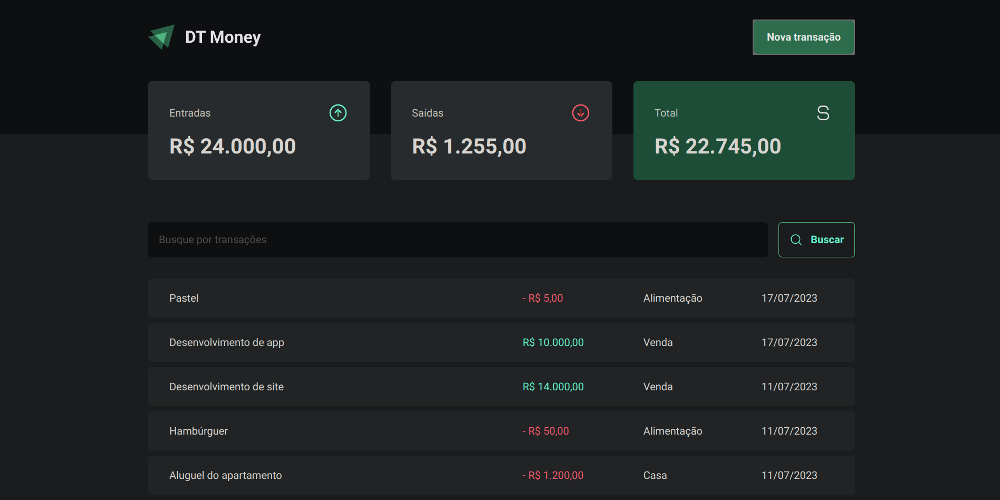
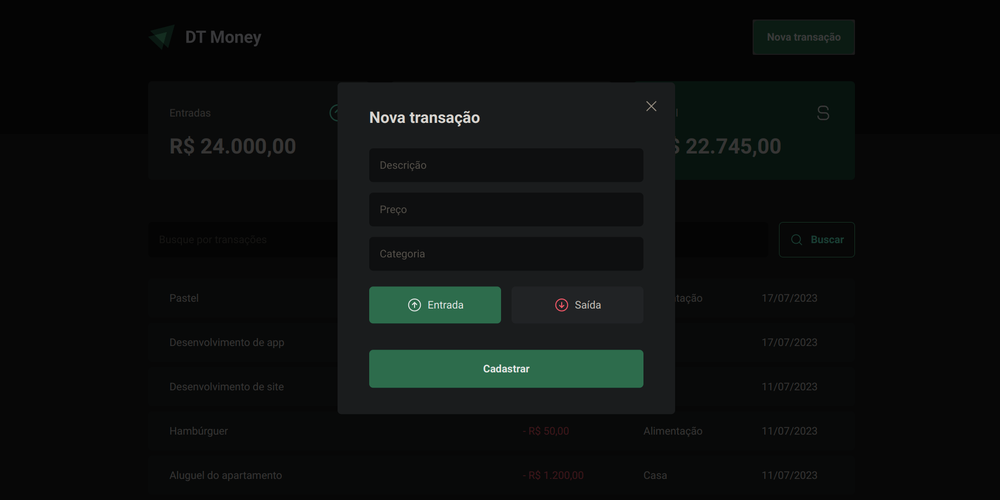
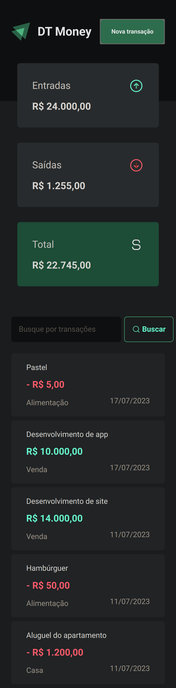

  <a href="#-tecnologias">Tecnologias</a>&nbsp;&nbsp;&nbsp;|&nbsp;&nbsp;&nbsp;
  <a href="#-projeto">Projeto</a>&nbsp;&nbsp;&nbsp;|&nbsp;&nbsp;&nbsp;
  <a href="#-como-rodar">Como rodar</a>&nbsp;&nbsp;&nbsp;|&nbsp;&nbsp;&nbsp;
  <a href="#-como-contribuir">Como contribuir</a>&nbsp;&nbsp;&nbsp;
  

 

# DT Money

## 🚀 Tecnologias

Esse projeto foi desenvolvido com as seguintes tecnologias:

- [Nodejs](https://nodejs.org/en/) - v18.12.1
- [Npm](https://www.npmjs.com/) - 8.19.2
- [Vite](https://vitejs.dev/) - ^4.3.9
- [TypeScript](https://www.typescriptlang.org/) - ^5.0.2
- [Styled-components](https://styled-components.com/) - ^6.0.2
- [JSON Server](https://github.com/typicode/json-server) - ^0.17.3
- [Axios](https://axios-http.com/ptbr/docs/intro) - ^1.4.0
- [@radix-ui/react-dialog](https://www.radix-ui.com/docs/primitives/components/dialog#dialog) - ^1.0.4
- [@radix-ui/react-radio-group](https://www.radix-ui.com/docs/primitives/components/radio-group#radio-group) - ^1.1.3
- [use-context-selector](https://github.com/dai-shi/use-context-selector) - ^1.4.1
- [React Hook Form](https://react-hook-form.com/) - ^7.45.1
- [Zod](https://zod.dev/) - ^3.21.4
- [Phosphor Icons](https://github.com/phosphor-icons/react)

## 💻 Projeto

Projeto de um controle financeiro onde conseguimos cadastrar as entradas e as saídas, temos o cálculo do valor total e podemos buscar transações.

- Módulo ReactJS do Ignite na plataforma da [Rocketseat](https://www.rocketseat.com.br/).

  

  

  

## ⚙️ Como Rodar

- Clone o projeto.
- Entre na pasta do projeto e rode 'npm install' (use 'yarn install' se for essa a sua configuração).
- npm run dev para rodar o projeto na porta indicada.
- npx json-server server.json para rodar o arquivo do banco de dados.

## 🤔 Como contribuir

- Faça um fork desse repositório;
- Cria uma branch com a sua feature: `git checkout -b minha-feature`;
- Faça commit das suas alterações: `git commit -m 'feat: Minha nova feature'`;
- Faça push para a sua branch: `git push origin minha-feature`.

Depois que o merge da sua pull request for feito, você pode deletar a sua branch.

## 📝 Licença

Esse projeto está sob a licença MIT.
